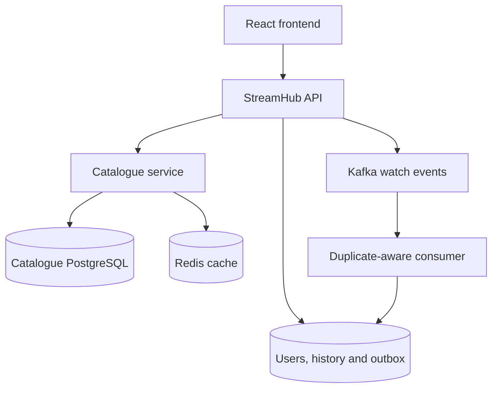

# StreamHub

A Java 21 / Spring Boot media-platform demonstration with a React frontend, a separate catalogue service, PostgreSQL persistence, Redis caching and Kafka watch events.

**Deployment status:** implementation and Docker integration checks pass in [GitHub Actions](https://github.com/DennyM55/streamhub/actions/runs/36125821385). Public hosting is pending account setup. A live URL will be added here only after the hosted user flows pass verification. See the [verification record](deploy/VERIFICATION.md).

## Try it locally

Requires Docker with Compose and OpenSSL. The initial build downloads Maven and npm dependencies.

```bash
bash scripts/setup-local.sh
docker compose up --build -d
```

Open **http://localhost:8088**. Choose **Try the demo** to get an isolated guest account, or register an account. The catalogue seeds twelve demonstration entries, including four open-film previews. Film credits appear in the frontend.

The setup script generates local secrets in an ignored `.env` file. Both Java applications run as non-root container users. The Compose project uses its own `streamhub-demo` data volumes, separate from the older development setup.

## Nine catalogue/user capabilities

| Capability | Implementation |
| --- | --- |
| Registration | Validated users and BCrypt password hashes |
| Login and authenticated access | Signed JWTs, expiry validation and protected user APIs |
| Catalogue management | Create/read/update/delete through a dedicated catalogue service; writes require an admin key |
| Search | Title search |
| Filtering | Genre, release year and duration filters |
| Pagination | Bounded page size and sort handling |
| Favourites | Add, list and remove favourites for the signed-in user |
| Watch history | History ordered by recency, isolated by user |
| Playback progress | Validated saved position plus transactional watch event recording |

The public frontend provides browse/search/filter/pagination, guest/login/register, favourites, watch history and progress saving. Administrative catalogue mutations are exercised by tests and API calls, not exposed to public demo visitors.

## Architecture



The edge API uses HTTP to read and mutate the catalogue. It stores movie IDs and title snapshots in watch history, without a cross-service entity relationship. Separate logical databases are used by the included Compose setup.

### Caching and downstream failures

Catalogue lookups use Redis cache-aside reads and update/delete eviction. A batch endpoint assembles favourites without one remote request per favourite. The edge client has connection/read timeouts, a programmatic Resilience4j retry and a circuit breaker. Unit tests exercise both retry and open-circuit behaviour.

### Kafka delivery

Saving progress also writes a durable outbox row in the same database transaction. A scheduled publisher waits for Kafka acknowledgement before marking the row published. The consumer stores an event ID using a unique database key so redelivery is suppressed. Failed handling is retried and then sent to a dead-letter topic; failure to publish the dead-letter record is not treated as success.

This is an at-least-once delivery design with duplicate suppression. The consumer records processing receipts and logs events; it does not implement recommendations or analytics aggregation. The local demo has a single Kafka broker, so it does not provide broker redundancy.

## API

| Method | Route | Access |
| --- | --- | --- |
| GET | `/health` | Public application liveness |
| GET | `/movies`, `/movies/{id}`, `/movies/genres` | Public |
| POST | `/demo/session` | Public; isolated guest token |
| POST | `/users`, `/users/login` | Public |
| GET/POST/DELETE | `/favorites`, `/favorites/{movieId}` | Bearer token |
| GET/PUT | `/history`, `/history/{movieId}` | Bearer token |
| POST/PUT/DELETE | `/movies`, `/movies/{id}` | `X-Admin-Key` |

The catalogue service additionally requires `X-Catalog-Key` for mutations. These keys are never part of the frontend bundle.

## Verification

```bash
# Real running API checks (requires the Compose stack)
python3 scripts/smoke.py

# Java unit/security/resilience tests
bash mvnw test
(cd catalog-service && bash mvnw test)

# Frontend tests and production build
(cd frontend && npm ci && npm test -- --run && npm run lint && npm run build)
```

The PostgreSQL Testcontainers tests run when Docker is available. Context tests additionally require `RUN_SYSTEM_TESTS=true` and configured running dependencies. The GitHub workflow runs Java tests, frontend tests/build, and a full Docker-stack smoke test including durable Kafka-consumer evidence. A skipped infrastructure test is not treated as verified deployment coverage.

The smoke test checks catalogue reads/search/pagination, JWT rejection, isolated guests, favourites, progress validation/persistence, registration/login and public mutation denial. Supplying `ADMIN_API_KEY` adds administrator CRUD and cache invalidation checks. Tokens and secrets are not printed.

## Hosting

See [deployment configuration](deploy/README.md). Render free static hosting is configured for the frontend, with Vercel supported as an alternative; Docker hosting runs the Java services. PostgreSQL, Redis and Kafka require separate hosted resources. Free hosting may sleep or suspend services when quotas are reached; a public demo is not a production SLA.

## Current scope and limits

- Personal portfolio demonstration; no measured production throughput or real customer scale is claimed.
- Standard media URLs and browser playback; no transcoding, DRM, CDN packaging or paid content distribution.
- Hibernate schema updates suit the fresh demo deployment. Existing installations require a deliberate data migration before adopting the new service split.
- OpenSearch, Kubernetes, AWS deployment, recommendations and AI are outside this release.
- Guest accounts are isolated but persist until maintenance removes them; production abuse controls, guest expiry and operational backup/restore policies remain future work.
