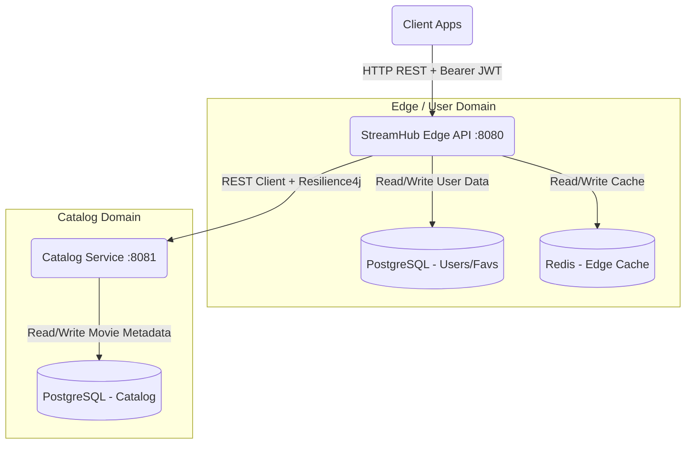
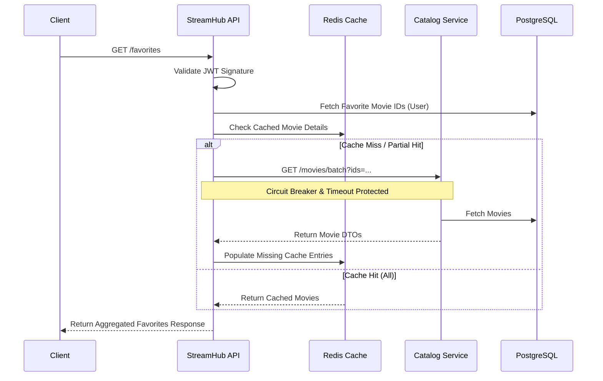

# StreamHub

A production-grade, microservice-based streaming platform backend. Designed with fault tolerance, scalability, and clean architecture in mind, StreamHub utilizes Java 21, Spring Boot, PostgreSQL, Redis, and stateless JWT authentication.

## System Architecture & High-Level Design (HLD)

StreamHub employs a distributed architecture separating user-centric domains from core catalog metadata. The main `StreamHub API` acts as an edge service and API aggregator, communicating with the downstream `Catalog Service` to hydrate user requests.



### Key Architectural Components
- **StreamHub API (Edge/Aggregator)**: Handles authentication, JWT validation, user favorites, and watch history. It acts as an API gateway of sorts, aggregating data by querying the Catalog Service.
- **Catalog Service**: A dedicated domain service managing movie entities, search algorithms, and metadata filtering.
- **PostgreSQL**: Relational persistence for reliable ACID transactions across domains.
- **Redis**: Distributed caching layer for high-throughput read operations, significantly reducing database latency on hot paths.

## Low-Level Design (LLD) & Data Flow

### Resilient Data Aggregation (Favorites Flow)
When a user requests their favorite list, the system must aggregate user-specific state with catalog metadata. To guarantee high availability and prevent cascading failures, inter-service communication is protected by **Resilience4j Circuit Breakers** and **Retry** mechanisms.



## Engineering Principles & Patterns

1. **Stateless Security (JWT)**: Built on Spring Security with JWT filters. The server holds no session state, allowing the auth layer to scale horizontally. 
2. **Cache-Aside Pattern & Deterministic Eviction**: Heavy read APIs are backed by Redis. Mutation operations (`PUT`, `DELETE`) trigger targeted cache invalidation, enforcing eventual consistency while mitigating stale reads.
3. **Fail-Fast & Circuit Breaking**: The StreamHub API wraps downstream HTTP calls in Resilience4j circuit breakers. If the catalog degrades, the edge service fails fast rather than exhausting thread pools, protecting global system stability.
4. **API Composition**: StreamHub handles scatter-gather logic natively (e.g., retrieving watch history timestamps and hydrating them with real-time movie metadata via batch lookups).

## API Specifications

### Users / Auth
| Method | Endpoint | Purpose |
| --- | --- | --- |
| `POST` | `/users` | Register a new user |
| `POST` | `/users/login` | Authenticate and return signed JWT |

### Movies (via Edge API)
| Method | Endpoint | Purpose |
| --- | --- | --- |
| `GET` | `/movies` | List/search/filter movies |
| `GET` | `/movies/{id}` | Get one movie |
| `POST` | `/movies` | Create movie |
| `PUT` | `/movies/{id}` | Update movie and evict cache |
| `DELETE` | `/movies/{id}` | Delete movie and evict cache |

### Favorites
| Method | Endpoint | Purpose |
| --- | --- | --- |
| `POST` | `/favorites/{movieId}` | Add movie to authenticated user's favorites |
| `GET` | `/favorites` | List authenticated user's favorites |
| `DELETE` | `/favorites/{movieId}` | Remove movie from authenticated user's favorites |

### Watch History
| Method | Endpoint | Purpose |
| --- | --- | --- |
| `PUT` | `/history/{movieId}` | Upsert playback progress |
| `GET` | `/history` | Get watch history ordered by recency |

## Local Development & Operations

### Prerequisites
- Java 21
- Docker Desktop
- Maven Wrapper (included)

### Infrastructure Setup
Spin up PostgreSQL (`localhost:5432`) and Redis (`localhost:6379`) via Docker Compose:
```powershell
docker compose up -d
```

### Run StreamHub (Edge API)
Main edge API runs on `http://localhost:8080`:
```powershell
.\mvnw.cmd spring-boot:run
```
*(Note: If PostgreSQL rejects the JVM timezone `Asia/Calcutta`, inject a valid timezone using `$env:JAVA_TOOL_OPTIONS="-Duser.timezone=Asia/Kolkata"` prior to running).*

### Run Catalog Service
Catalog service runs on `http://localhost:8081`:
```powershell
cd catalog-service
.\mvnw.cmd spring-boot:run
```

## Flow Testing & Verification
The repository includes `.http` request files that serve as executable documentation and operational integration checks:
- `flow.http` - End-to-end API and JWT lifecycle testing.
- `favorite-flow-testing.http` - State verification for favorite toggling.
- `redis-flow.http` - Verifies cache hits and invalidation logic.
- `microservices.http` - Service-to-service validation.

Variables are propagated dynamically across tests (e.g., extracting JWTs from login responses and injecting them as Bearer tokens in downstream requests).

## Roadmap & Future Enhancements
- **Automated Integration Pipelines**: Expand CI checks for resilience degradation.
- **Config Externalization**: Vault or Spring Cloud Config integration for JWT secrets and service URIs.
- **Observability**: Add OpenTelemetry tracing across the Edge and Catalog boundary.
- **Containerization**: Multi-stage Dockerfiles for Kubernetes deployment.
