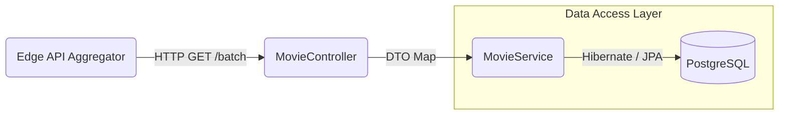

# Catalog Service

A specialized microservice acting as the source of truth for movie metadata within the StreamHub ecosystem. Designed as an independent domain service, it provides scalable CRUD, advanced pagination, and optimized batch retrieval for edge aggregators.

## System Role & Design

The Catalog Service is purposefully decoupled from user-state (authentication, favorites) to allow independent scaling and isolated failure domains.

### Low-Level Design (LLD) & Data Retrieval



### Engineering Decisions
- **Batch Optimization**: Exposes a `/movies/batch` endpoint specifically tailored for N+1 query prevention when the edge service aggregates user favorites.
- **Stateless Operation**: Enforces a strict shared-nothing architecture, allowing for aggressive horizontal pod autoscaling under heavy read traffic.
- **Relational Integrity**: Leverages PostgreSQL for strict schema enforcement over movie metadata.

## Setup & Requirements

- **Java 21**
- **Maven Wrapper (included)**
- **PostgreSQL** (default: `jdbc:postgresql://localhost:5432/streamhub`)
- **Redis** (optional, default host: `localhost:6379`)

### Local Configuration
Configuration overrides can be applied via `src/main/resources/application.properties` or standard environment variables (e.g., `SPRING_DATASOURCE_URL`).

## Build & Deploy

Compile and package the service into a runnable artifact:
```powershell
.\mvnw.cmd clean package
```

Run locally on default port `8081`:
```powershell
.\mvnw.cmd spring-boot:run
```
*(Alternatively, execute the compiled JAR directly via `java -jar target/catalog-service-0.0.1-SNAPSHOT.jar`)*

## API Interface

Base Path: `/movies`

| Endpoint | Method | Description |
|---|---|---|
| `?page=0&size=10&search=term` | `GET` | Paginated search with dynamic filters |
| `/{id}` | `GET` | Retrieve precise movie metadata |
| `/batch?ids=1,2,3` | `GET` | High-throughput batch hydration |
| `/` | `POST` | Ingest new movie record (201 Created) |
| `/{id}` | `PUT` | Full metadata mutation |
| `/{id}` | `DELETE` | Hard delete record (204 No Content) |

### Sample Payload
```json
{
  "title": "Example Movie",
  "description": "Short description",
  "genre": "Drama",
  "releaseYear": 2024,
  "durationMinutes": 120,
  "thumbnailUrl": "https://.../thumb.jpg",
  "mediaUrl": "https://.../media.mp4"
}
```

## Testing & Quality Assurance
Run the integrated test suite:
```powershell
.\mvnw.cmd test
```
